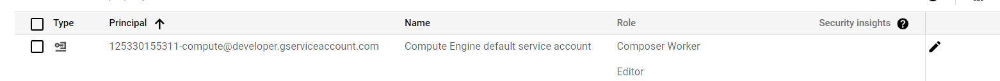
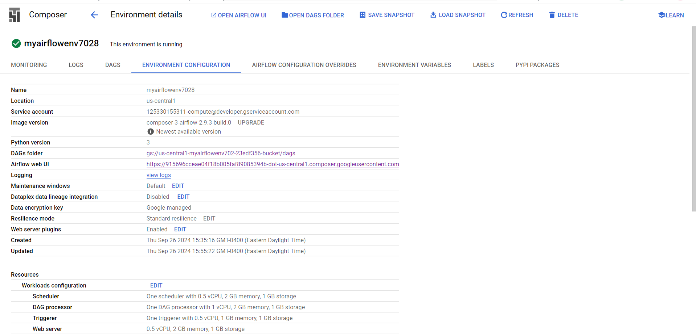
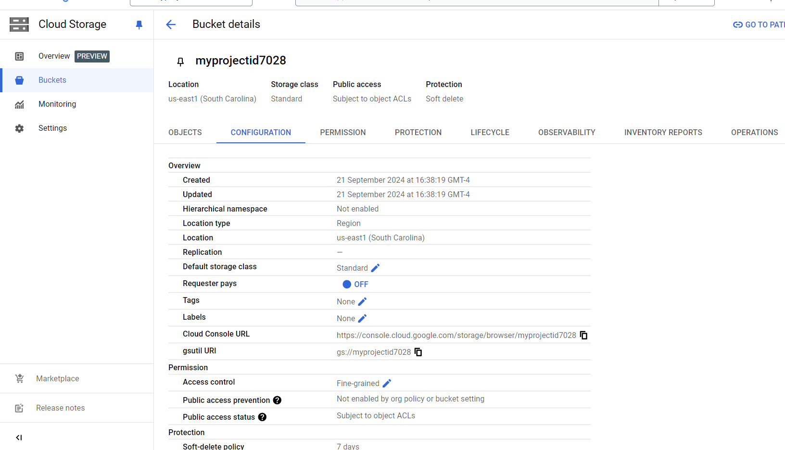

# Automated ETL pipeline using Cloud Composer (Airflow) and Dataproc (Spark)

## Project Overview

Cloud Composer is the tool for hosting workflows and it is a hosted version of the popular open source workflow tool Apache Airflow.

In this project we will use Google Cloud console to set up a Cloud Composer environment. We will then use Cloud Composer to go through a simple workflow that verifies the existence of a data file, creates a Cloud Dataproc cluster, runs an Apache Hadoop wordcount job on the Cloud Dataproc cluster, and deletes the Cloud Dataproc cluster afterwards.


## Objective

* Use the Google Cloud console to create the Cloud Composer environment.

* Use the Cloud Composer View and run the DAG (Directed Acyclic Graph) in the Airflow web interface.

* View the results of the wordcount job in storage.


## Task 1 : Setting up Environment 

### STEP 1 : Activate Cloud Shell & Autheticate 

```powershell

gcloud auth login
gcloud config set project myprojectid7028


export PROJECT_ID=$(gcloud config get-value project)
echo $PROJECT_ID


export PROJECT_NUMBER=$(gcloud projects describe $PROJECT_ID --format="value(projectNumber)")
echo $PROJECT_NUMBER
```

### STEP 2 : Grant the Compute Engine default service account the Cloud Composer worker role to manage Airflow tasks in the specified project.

```bash
gcloud projects add-iam-policy-binding $PROJECT_ID --mem
ber=serviceAccount:$PROJECT_NUMBER-compute@developer.gserviceaccount.com --role=roles/composer.worker
```

The command assigns the composer.worker role to the Compute Engine default service account in the project, enabling it to interact with resources needed by Cloud Composer, particularly to manage tasks related to running Airflow DAGs.

This is typically done when setting up Cloud Composer to ensure that the required service accounts have appropriate permissions for managing Airflow environments.



### STEP 3 : Enabling required API's

```bash
# Disable APIs
gcloud services enable artifactregistry.googleapis.com
gcloud services enable container.googleapis.com
gcloud services enable composer.googleapis.com

#Enable APIs
gcloud services enable artifactregistry.googleapis.com
gcloud services enable container.googleapis.com
gcloud services enable composer.googleapis.com

```

<br>
<br>


## Task 2. Create Cloud Composer environment

### STEP 1 : Create Cloud Composer environment

We will create this bucket using Google cloud UI 

Below properties 

| Property | Value | 
|----------|----------|
| Name   | myairflowenv7028  | 
| Location   | us-central1   | 
| Image Versio   | composer-3-airflow-n.n.n-build.n    | 




### SETP 2 : Create a Cloud Storage bucket

Create a Cloud Storage bucket in your project. This bucket will be used as output for the Hadoop job from Dataproc.

We will create this bucket using Google cloud UI 




## Task 4. Defining the workflow

Now let's discuss the workflow you'll be using. 

loud Composer workflows are comprised of DAGs (Directed Acyclic Graphs). DAGs are defined in standard Python files that are placed in Airflow's DAG_FOLDER. 

Airflow will execute the code in each file to dynamically build the DAG objects. 

You can have as many DAGs as you want, each describing an arbitrary number of tasks. 

In general, each one should correspond to a single logical workflow.

